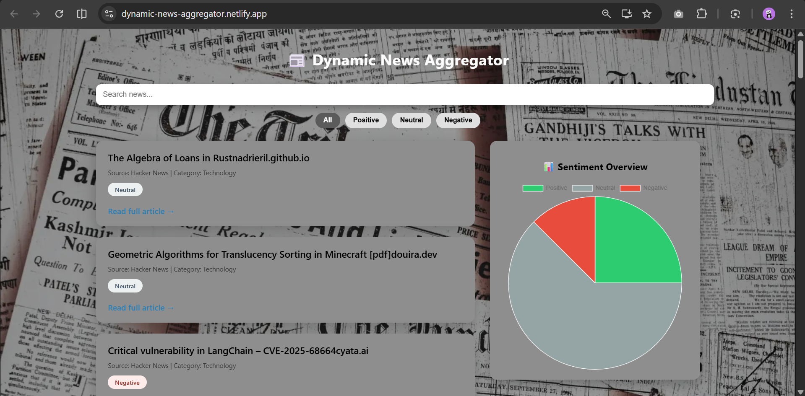
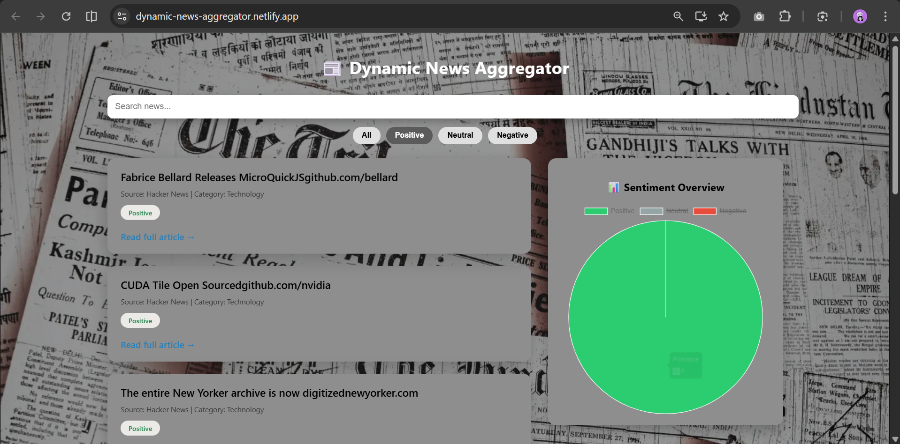
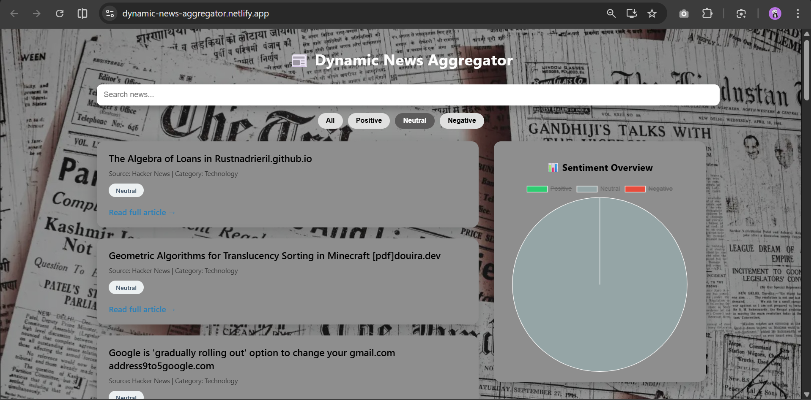
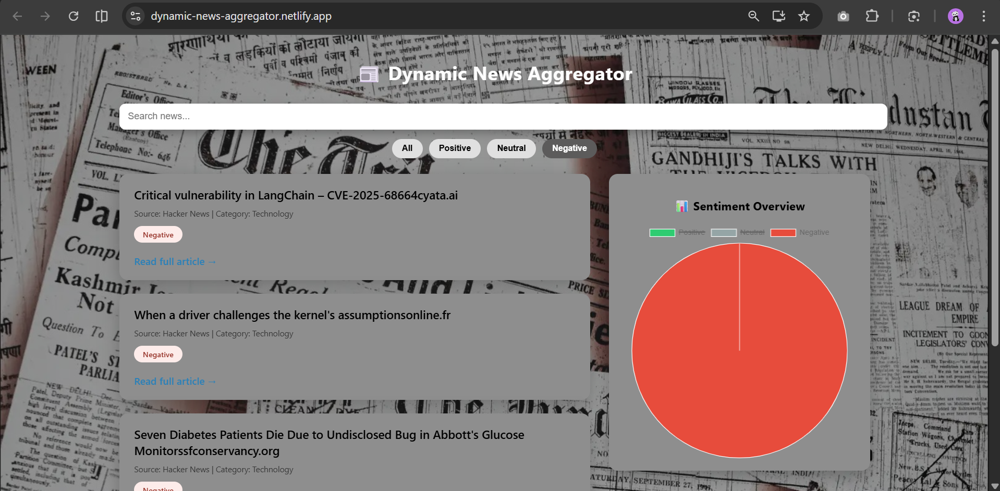

# 📰 Dynamic News Aggregator with Sentiment Analysis

A full-stack web application that aggregates real-time news, analyzes sentiment using AI, and visualizes insights through an interactive dashboard.

---

## 🚀 Live Demo

- **Frontend:**
  https://dynamic-news-aggregator.netlify.app/
- **Backend API:**  https://dynamic-news-aggregator.onrender.com/api/news

---

## ✨ Features

- 🤖 AI-powered sentiment analysis (Positive / Neutral / Negative)
- 📊 Sentiment overview pie chart
- 🎛️ Search and sentiment filters
- 📱 Responsive UI layout
- ☁️ Cloud deployment (Frontend + Backend)

---

## 🛠️ Tech Stack

### Frontend
- React.js
- Chart.js
- CSS

### Backend
- Node.js
- Express.js
- Cheerio (web scraping)
- Google Gemini API (sentiment analysis)

### Database
- MongoDB Atlas

### Deployment
- Frontend: Netlify
- Backend: Render
- Database: MongoDB Atlas

## 📸 Screenshots

### 🏠 Home Page

### 🟢 Positive news

### 🔘 Neutral news

### 🔴 Negative news

---
## ⚙️ Environment Variables

### Backend (.env on Render)
MONGO_URI=your_mongodb_connection_string

GEMINI_API_KEY=your_gemini_api_key
PORT=5000

### Frontend (Netlify)
REACT_APP_API_URL=https://dynamic-news-aggregator.onrender.com/api/news

---
👩‍💻 Author
Chandini Sri Mounika vissamsetti

GitHub: [https://github.com/chandinisrimounika](https://github.com/ChandiniSriMounika)

This project demonstrates full-stack development, AI integration, and cloud deployment using modern web technologies.
